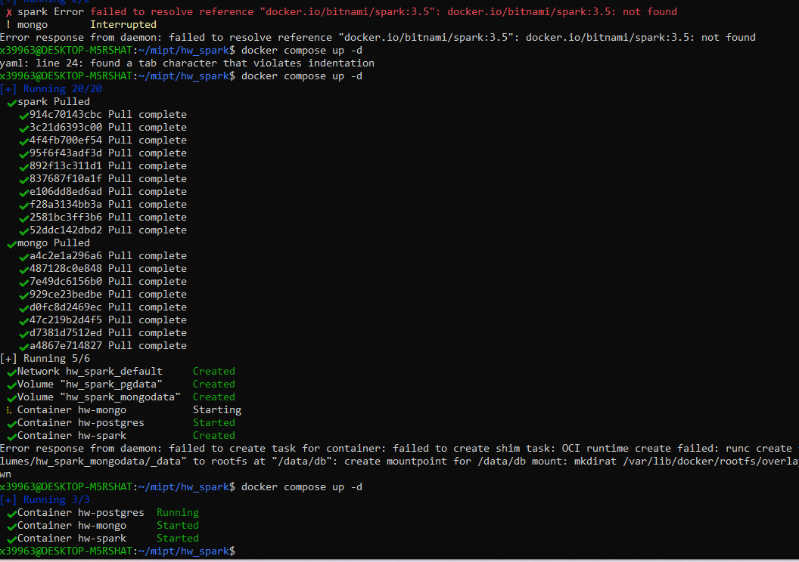
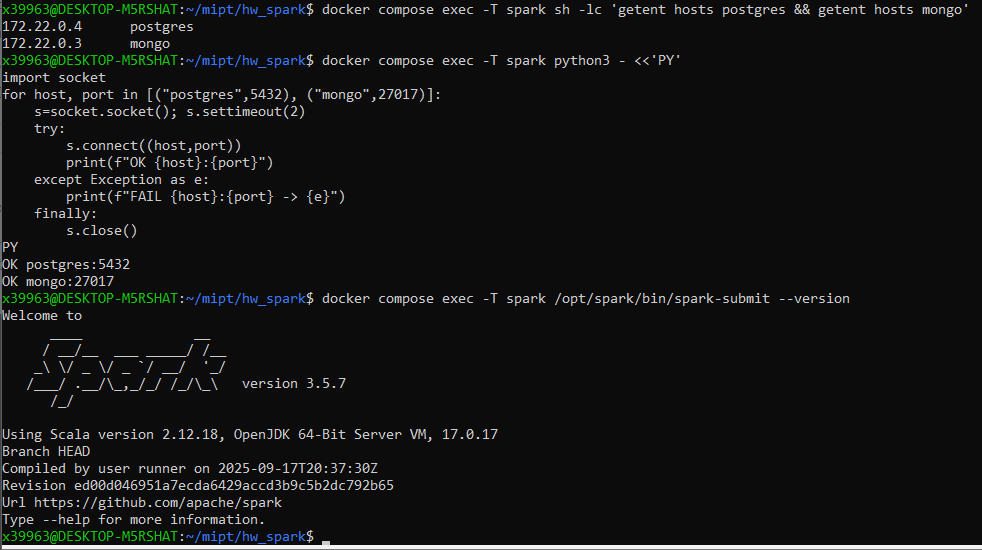
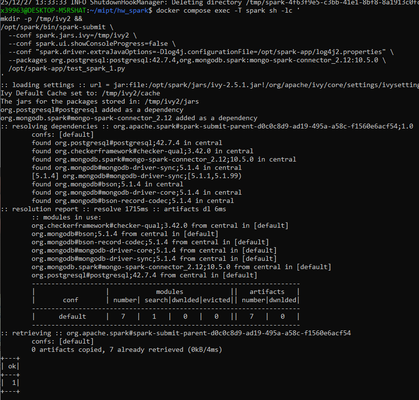
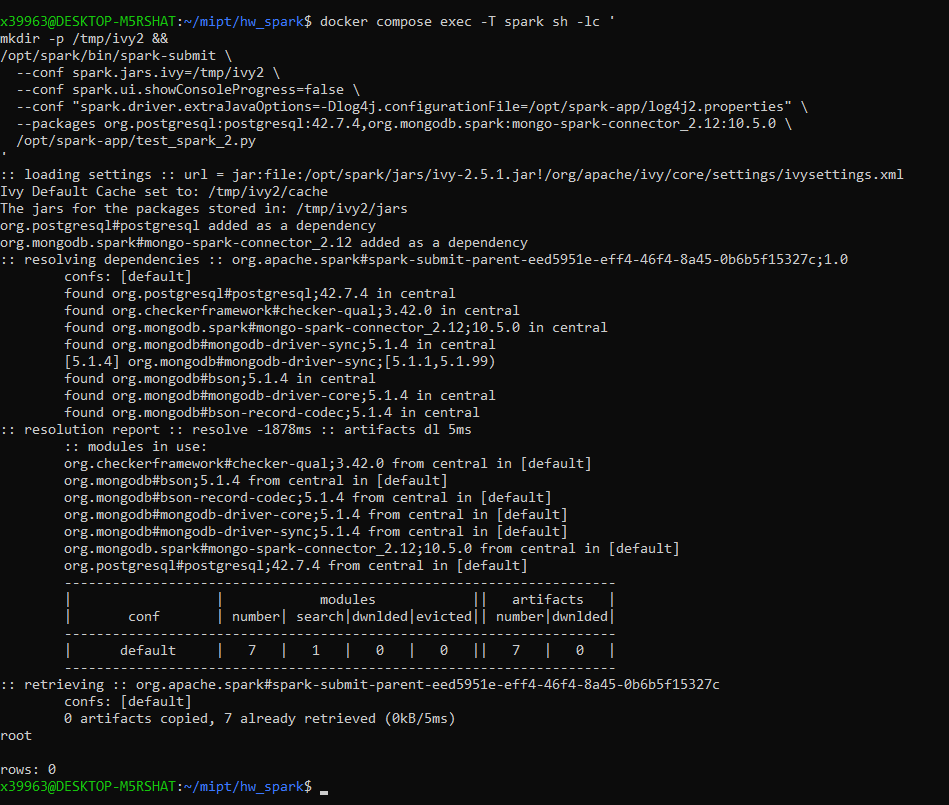
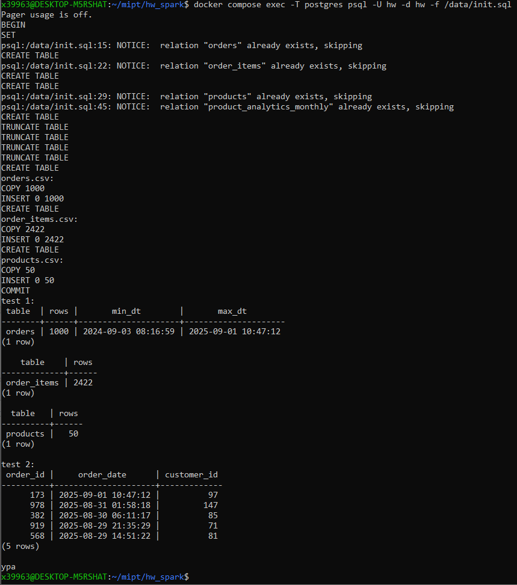
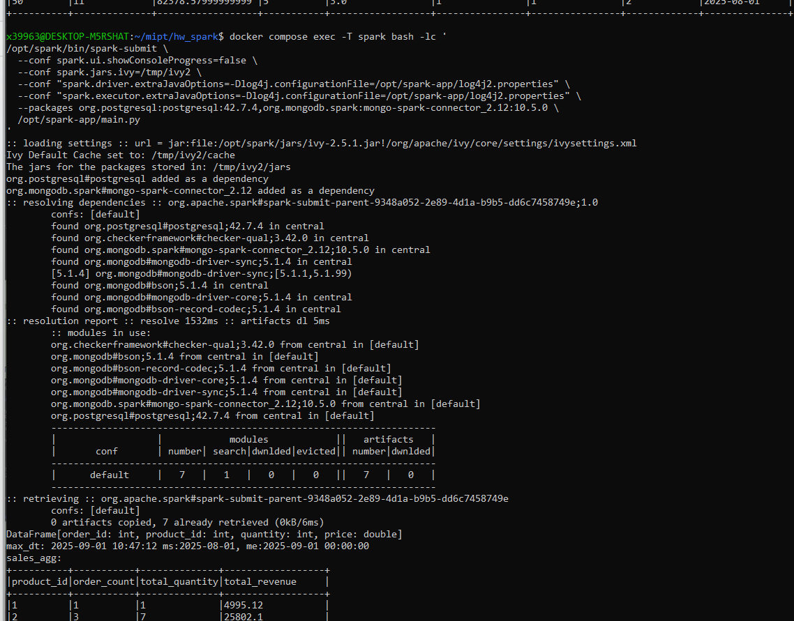
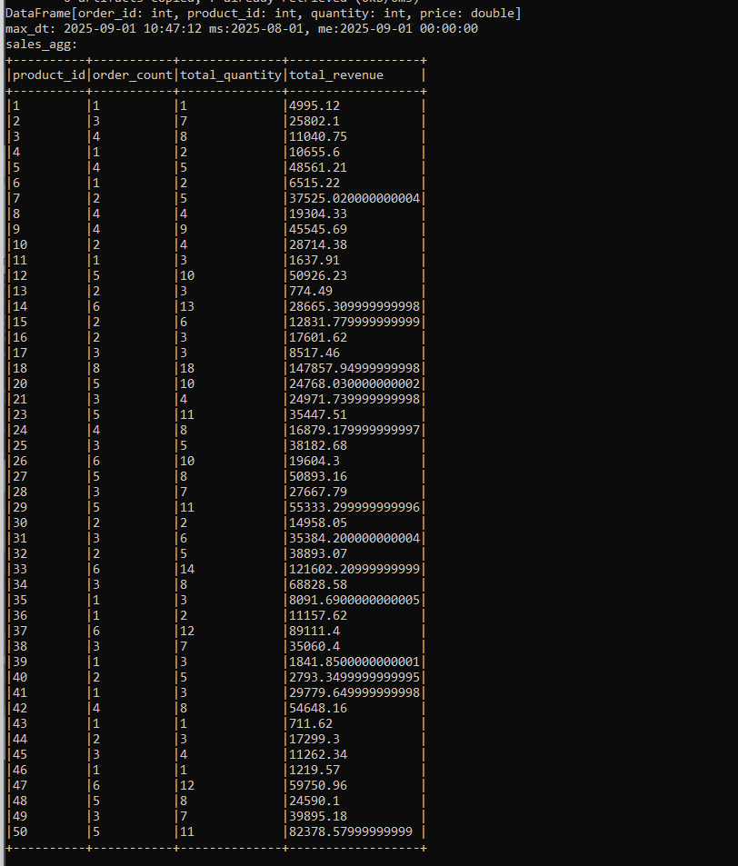
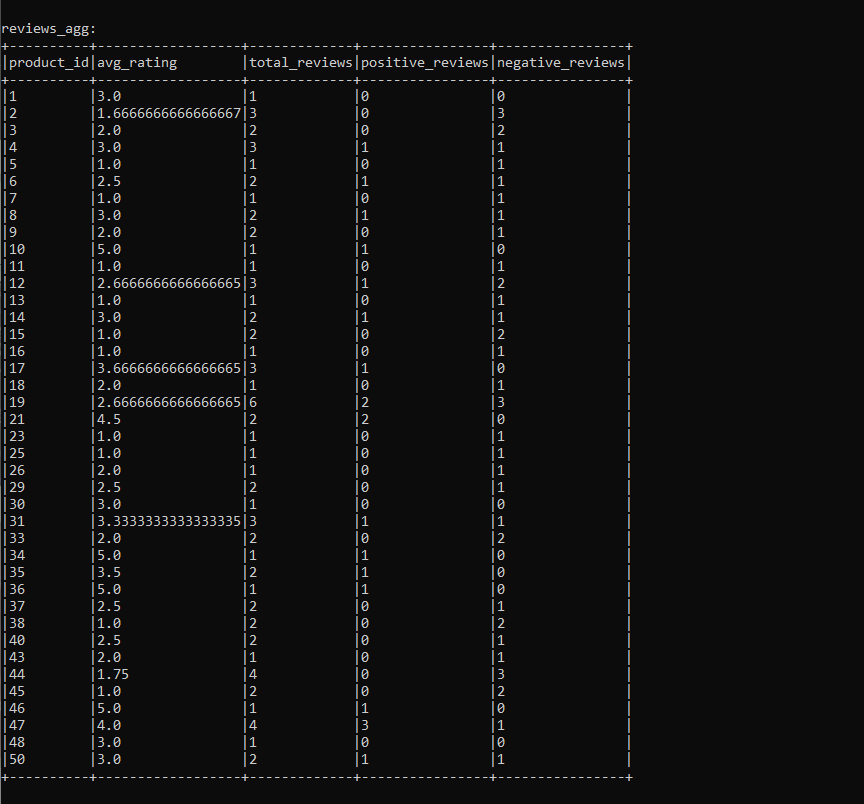
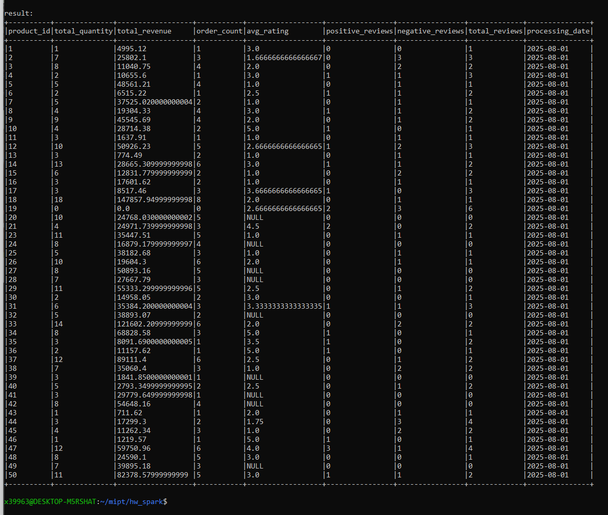

# Системы хранения и обработки данных: диф. зачет (письменное задание)
## Новиков Иван

---

# 0. Содержание и артефакты:

В репозитории:

**0.1 репозиторий (тут оформлен README.md со всеми картинками)**
- https://github.com/0x39f963/db-novikov_zachet

**0.2 главнгый файл с кодом ДЗ (есть еще sql скрипт дополнительно, для импорта данных)**
- ./spark/main.py

**0.3 ноутбук, который дублирует информацию, которая изложена в README.md**
- ./NovikovIA.ipynb
 
*(README открывается сразу при переходе в репу, мне кажется, что так удобнее)*

**0.4 Содержание:**
-  Развертывание: wsl2 / docker / win11
-  Скрипт предварительной загрузки данных в postgres и скриншоты выполнения
-  Основной код ДЗ и скриншоты выполнения

.

# 1. Развертывание: wsl2 / docker / win11

1.0  Развертывалось в wsl2 / docker (win11). В репозиторий зашли все файлы/конфиги для развертывания.

В репозитории имеются 
docker-compose.yml
и 
./spark/test_spark_1.py
./spark/test_spark_2.py

**1.1**  Поднимаем контейнеры 


.

**1.2**  Проверяем, что все собралось, порты, версию спарка:



**1.3 **  Тестирование обращения к postgre и к mongo из spark 

*(приведен в т.ч. код тест скриптов, как можно догодаться, завелось все сильно не с первого раза, в т.ч. пришлось подбирать версию коннектора)*
**1.3.1 ./spark/test_spark_1.py** 

```python

from pyspark.sql import SparkSession

spark = SparkSession.builder.appName("pg-smoke").getOrCreate()

url = "jdbc:postgresql://postgres:5432/hw"
props = {"user":"hw","password":"hwpass","driver":"org.postgresql.Driver"}

df = spark.read.jdbc(url, "(select 1 as ok) t", properties=props)
df.show()

spark.stop()

```




.


**1.3.2 ./spark/test_spark_2.py** 

```python

from pyspark.sql import SparkSession

spark = (
    SparkSession.builder
    .appName("mongo-smoke")
    .config("spark.mongodb.read.connection.uri", "mongodb://mongo:27017/hw")
    .getOrCreate()
)

try:
    df = spark.read.format("mongodb").option("collection","reviews").load()
    df.printSchema()
    print("rows:", df.limit(1).count())
except Exception as e:
    print("Mongo read failed:", e)

spark.stop()

```




.


# 2. Скрипт предварительной загрузки данных в postgres и скриншоты выполнения:

**./data/init.sql в репозитории**

```sql

\set ON_ERROR_STOP on
\pset pager off

BEGIN;

SET client_encoding = 'UTF8';

-- 1. базовые таблицы + таблица для резульататов

CREATE TABLE IF NOT EXISTS orders (
	order_id int4 NOT NULL,
    order_date timestamp NOT NULL,
    customer_id int4 NOT NULL,
    CONSTRAINT pk_orders PRIMARY KEY  (order_id)
);

CREATE TABLE IF NOT EXISTS order_items (
    order_id int4 NOT NULL,
    product_id int4 NOT NULL,
    quantity int4 NOT NULL,
    price float8 NOT NULL
);

CREATE TABLE IF NOT EXISTS products (
    product_id int4 NOT NULL,
    product_name text NOT NULL,
    category text NOT NULL,
    CONSTRAINT pk_products PRIMARY KEY (product_id)
);


-- 

CREATE TABLE IF NOT EXISTS product_analytics_monthly (
    product_id int4 NOT NULL,
    total_quantity int8 NOT NULL,
    total_revenue float8 NOT NULL,
    order_count int8 NOT NULL,
    avg_rating float8,
    positive_reviews int8 NOT NULL,
    negative_reviews int8 NOT NULL,
    total_reviews int8 NOT NULL,
    processing_date date NOT NULL,
    CONSTRAINT pk_product_analytics_monthly PRIMARY KEY (processing_date, product_id)
);


-- 2. для повторных прогонов

TRUNCATE TABLE order_items;
TRUNCATE TABLE orders;
TRUNCATE TABLE products;
TRUNCATE TABLE product_analytics_monthly;


-- 3. временгные таблицы для загрузки данных:


-- orders.csv

CREATE TEMP TABLE _stg_orders (order_id int4, customer_id int4, order_date_txt text);

\echo 'orders.csv:'
\copy _stg_orders(order_id, customer_id, order_date_txt) FROM '/data/orders.csv' WITH (FORMAT csv, HEADER true, DELIMITER ',', QUOTE '"');

INSERT INTO orders(order_id, order_date, customer_id)
SELECT order_id, NULLIF(order_date_txt, '')::timestamp AS order_date, customer_id FROM _stg_orders;


-- order_items.csv:

CREATE TEMP TABLE _stg_order_items (order_item_id int4, order_id int4, product_id int4, quantity int4, price float8);

\echo 'order_items.csv:'
\copy _stg_order_items(order_item_id, order_id, product_id, quantity, price) FROM '/data/order_items.csv' WITH (FORMAT csv, HEADER true, DELIMITER ',', QUOTE '"');


INSERT INTO order_items(order_id, product_id, quantity, price) SELECT order_id, product_id, quantity, price FROM _stg_order_items;


-- products.csv: 
CREATE TEMP TABLE _stg_products (product_id int4, product_name text, category text, price text);

\echo 'products.csv:'
\copy _stg_products(product_id, product_name, category, price) FROM '/data/products.csv' WITH (FORMAT csv, HEADER true, DELIMITER ',', QUOTE '"');

INSERT INTO products(product_id, product_name, category) SELECT product_id, product_name, category FROM _stg_products;

COMMIT;


-- проверяем:

\echo 'test :'

SELECT * FROM orders ORDER BY order_date DESC LIMIT 5;

\echo 'ура'


```

*x39963@DESKTOP-M5RSHAT:~/mipt/hw_spark$ docker compose exec -T postgres psql -U hw -d hw -f /data/init.sql*




# 3. Основной код зачетной работы и скриншоты выполнения:

**./spark/main.py в репозитории**


```python

from pyspark.sql import SparkSession, functions as F

PG_URL = "jdbc:postgresql://postgres:5432/hw"
PG_PROPS = {"user": "hw", "password": "hwpass", "driver": "org.postgresql.Driver"}

MONGO_URI = "mongodb://mongo:27017"
MONGO_DB = "hw"
MONGO_COLL = "reviews"


# docker compose exec -T postgres psql -U hw -d hw -c "TRUNCATE TABLE product_analytics_monthly;"


def pg_exec(spark, sql: str) -> None:
    jvm = spark._sc._gateway.jvm

    # АААААааааа
    jvm.org.apache.spark.sql.execution.datasources.jdbc.DriverRegistry.register(
        PG_PROPS["driver"]
    )

    conn = jvm.java.sql.DriverManager.getConnection(
        PG_URL, PG_PROPS["user"], PG_PROPS["password"]
    )
    try:
        stmt = conn.createStatement()
        stmt.execute(sql)
        stmt.close()
    finally:
        conn.close()


def main():
    spark = (
        SparkSession.builder.appName("product-analytics-monthly")
        .config("spark.mongodb.read.connection.uri", MONGO_URI)
        .config("spark.mongodb.read.database", MONGO_DB)
        .config("spark.mongodb.read.collection", MONGO_COLL)
        .config("spark.ui.showConsoleProgress", "false")
        .getOrCreate()
    )

    spark.sparkContext.setLogLevel("ERROR")
    spark.sql("SET spark.sql.session.timeZone=UTC")

    # 1. читаем из постгри (jdbc)
    orders_df = spark.read.jdbc(PG_URL, "orders", properties=PG_PROPS).select(
        F.col("order_id").cast("int"),
        F.col("customer_id").cast("int"),
        F.col("order_date").cast("timestamp"),
    )
    orders_df.describe()

    order_items_df = spark.read.jdbc(PG_URL, "order_items", properties=PG_PROPS).select(
        F.col("order_id").cast("int"),
        F.col("product_id").cast("int"),
        F.col("quantity").cast("int"),
        F.col("price").cast("double"),
    )
    print(order_items_df)

    # 2. последний месяц
    # !!! LOOK: в чате писали, что сентябрь можно убрать / что это заапрувлено
    period = orders_df.select(
        F.max("order_date").alias("max_dt"),
        F.add_months(F.date_trunc("month", F.max("order_date")), -1).alias("ms"),
        F.date_trunc("month", F.max("order_date")).alias("me"),
    ).first()

    max_dt = period["max_dt"]
    ms = period["ms"]
    me = period["me"]

    print(f"max_dt: {max_dt} ms:{ms}, me:{me}")

    # 3. фильтр по посл месяцу
    orders_m = orders_df.where(
        (F.col("order_date") >= F.lit(ms)) & (F.col("order_date") < F.lit(me))
    )
    sales = order_items_df.join(
        orders_m.select("order_id"), on="order_id", how="inner"
    ).select("order_id", "product_id", "quantity", "price")

    # 4. отзывы, отфильтрованные по посл месяцу
    reviews_df = (
        spark.read.format("mongodb")
        .load()
        .select(
            F.col("product_id").cast("int").alias("product_id"),
            F.col("rating").cast("int").alias("rating"),
            F.col("created_at").cast("timestamp").alias("created_at"),
        )
    )

    reviews_m = reviews_df.where(
        (F.col("created_at") >= F.lit(ms)) & (F.col("created_at") < F.lit(me))
    )

    # 5. temp view для агрегации
    sales.createOrReplaceTempView("sales")
    reviews_m.createOrReplaceTempView("reviews_m")

    sales_agg = spark.sql(
        """
        SELECT
          product_id,
          COUNT(DISTINCT order_id)      AS order_count,
          SUM(CAST(quantity AS BIGINT)) AS total_quantity,
          SUM(quantity * price)         AS total_revenue
        FROM sales
        GROUP BY product_id
    """
    )
    print("sales_agg:")
    sales_agg.orderBy("product_id").show(50, truncate=False) # p.s. в таблице product у нас 50 записей

    reviews_agg = spark.sql(
        """
        SELECT
          product_id,
          AVG(CAST(rating AS DOUBLE)) AS avg_rating,
          COUNT(1)                    AS total_reviews,
          SUM(CASE WHEN rating IN (4,5) THEN 1 ELSE 0 END) AS positive_reviews,
          SUM(CASE WHEN rating IN (1,2) THEN 1 ELSE 0 END) AS negative_reviews
        FROM reviews_m
        GROUP BY product_id
    """
    )
    print("reviews_agg:")
    reviews_agg.orderBy("product_id").show(50, truncate=False)

    # 6. объединяем
    result = (
        sales_agg.join(reviews_agg, on="product_id", how="full")
        .na.fill(
            {
                "order_count": 0,
                "total_quantity": 0,
                "total_revenue": 0.0,
                "total_reviews": 0,
                "positive_reviews": 0,
                "negative_reviews": 0,
            }
        )
        .withColumn("processing_date", F.to_date(F.lit(ms)))
        .select(
            "product_id",
            "total_quantity",
            "total_revenue",
            "order_count",
            "avg_rating",
            "positive_reviews",
            "negative_reviews",
            "total_reviews",
            "processing_date",
        )
    )

    print("result:")
    result.orderBy("product_id").show(50, truncate=False) 

    # 7. записываем результаты 

    pg_exec(spark, "TRUNCATE TABLE product_analytics_monthly;")

    result.write.mode("append").jdbc(
        PG_URL, "product_analytics_monthly", properties=PG_PROPS
    )

    spark.stop()


if __name__ == "__main__":
    main()


```


**3.1**


.

**3.2**


.

**3.3**


.

**3.3**



